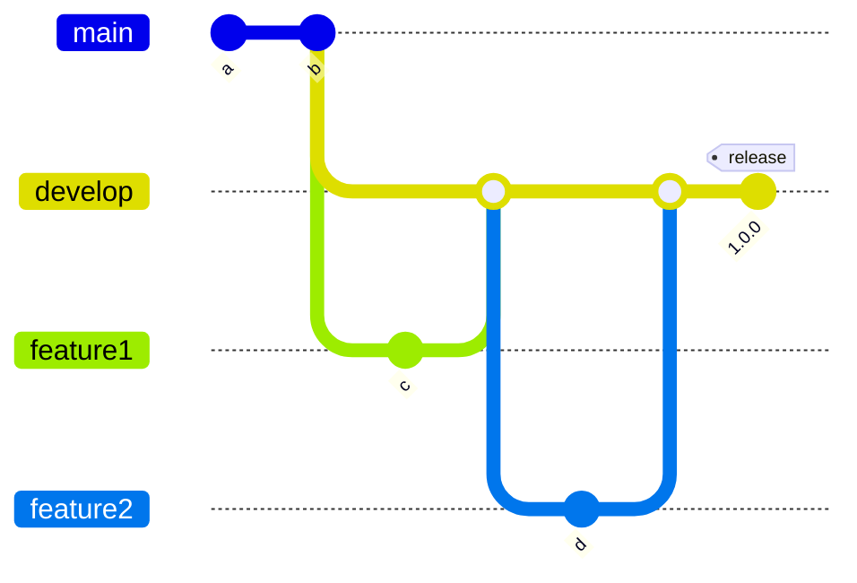

# Deployment

This chapter should provide the user with all needed information around the deployment of your project.

Currently, the B01LER project is getting deployed to [render.com](https://render.com) periodically. In the near future,
we intend on implementing a more formal deployment schedule so that the latest version of the project will be available
to view and interact with.

The project can be viewed [here](https://b01ler.onrender.com/). This link allows you to experiment with the project and
learn about how you can use components via Storybook.

We also deploy our JS Example app to [Render](https://b01ler.onrender.com/js-example-app). This application shows you
how our components look when implemented in a vanilla Javascript application.

## Content

- [Tooling](#tooling)
- [Release Please](#release-please)
- [Conventional Commit Messages](#conventional-commit-messages)
- [How to deploy](#how-to-deploy)
- [Versioning](#versioning)
- [Release Management](#release-management)
- [Deployment Schedule](#deployment-schedule)
- [Support](#support)

## Tooling

This project uses release-please and conventional commit messages for automated release creation and deploys the package
to the npm registry.

We use the [Git-Flow](https://www.atlassian.com/git/tutorials/comparing-workflows/gitflow-workflow) branching model:

## Release Please

Release Please automates CHANGELOG generation, the creation of GitHub releases, and version bumps for your projects.
Release Please does so by parsing the git history, looking for Conventional Commit messages, and creating release PRs.

The tool runs on every push to the `develop` branch and creates a release PR which needs to be manually be merged to
create the release. The release will only be created if the commit message has 'chore(release)' in it. for eg. git
commit -m "chore(release): this is a message".

Once the release PR is merged (back into `develop`), release-please automatically creates a GitHub release based on the
merged changes.

## Conventional Commit Messages

The commits must be compliant with with the
[Conventional Commits specification](https://www.conventionalcommits.org/en/v1.0.0/). The commit header should not
exceed a maximum character count of 140. The scope is allowed to be one of the following options: 'all', 'ui-library',
'icons', 'figma-design-tokens', 'tokens', or 'storybook'.

## How to deploy

Deployment is automated via the release-please workflow, which operates on the develop branch. Push changes to the
develop branch. The release-please workflow creates a release PR on develop with version bumps and changelog updates.
Review and merge the release PR back into develop. Once merged, the workflow publishes the package to the npm registry
and creates a GitHub release.

## Versioning

Please see [conventional commit messages](#conventional-commit-messages)

## Deployment Schedule

There is no deployment schedule. A new release is created whenever we have multiple new small features or a new big
feature that we want to release.

## Support

If support is needed while deploying BO1LER, please refer to our
[README feedback section](/README.md#tipping_hand_person-help--feedback) where we list the many ways that we can be
reached to support you.
